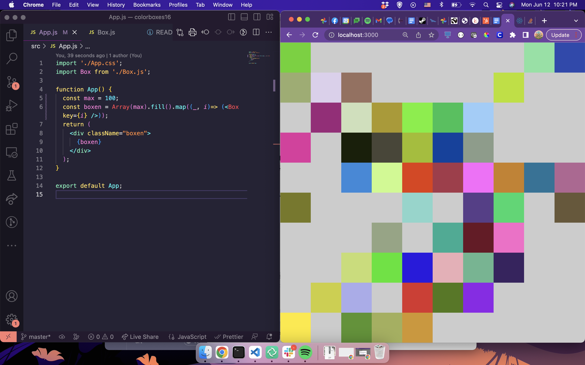

# colorboxes
This project (bootstrapped with [Create React App](https://github.com/facebook/create-react-app)), is a demo teaching app for [Academy Pittsburgh]([https://](https://www.academypgh.com/)). It's based off of Jennifer Dewalt's [Technicolor Boxes project](https://jenniferdewalt.com/technicolor_boxes.html).
# running
## first time
Install dependencies: `npm install`

## every time
Run the app: `npm start`

# a picture
